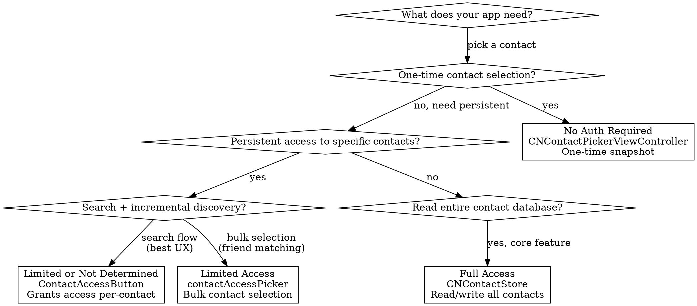

# Contacts — Discipline

## Core Philosophy

> "The contact access button is a powerful new way to manage access to contacts, right in your app. Instead of a full-screen picker, this button fits into your existing UI."

**Mental model**: Contacts has four authorization levels. Most apps should use the Contact Access Button or CNContactPickerViewController, which require no authorization at all. Only request store access when you need persistent contact data.

## When to Use This Skill

Use this skill when:
- Reading or writing contacts
- Choosing between picker, Contact Access Button, or full store access
- Requesting Contacts permissions
- Implementing contact search or selection UIs
- Migrating to iOS 18 limited access
- Building a Contact Provider extension
- Implementing incremental contact sync

Do NOT use this skill for:
- Calendar events or reminders (use **eventkit**)
- General privacy patterns (use **privacy-ux**)
- SwiftUI architecture (use **swiftui-architecture**)

## Related Skills

- **contacts-ref** — Complete Contacts/ContactsUI API reference
- **eventkit** — EventKit discipline skill
- **privacy-ux** — General iOS privacy and permission UX
- **keychain** — If storing contact-related credentials

---

## Access Level Decision Tree



---

## The Four Authorization Levels

### Not Determined

App hasn't requested access yet. `CNContactStore` auto-prompts on first access attempt. `ContactAccessButton` works in this state — tapping it triggers a simplified limited-access prompt.

### Limited Access (iOS 18+)

User selected specific contacts to share. Your app sees only those contacts via `CNContactStore`. The API surface is identical to full access — only the visible contacts differ.

**Your app always has access to contacts it creates**, regardless of authorization level.

### Full Access

Read/write access to all contacts. Users must explicitly choose "Full Access" in the two-stage prompt. Reserve this for apps where contacts are the core feature.

### Denied

No access to contact data. App cannot read, write, or enumerate contacts.

---

## Contact Access Button (iOS 18+)

The preferred way to give users control over which contacts your app can access. Shows search results for contacts your app doesn't yet have access to. One tap grants access.

```swift
@State private var searchText = ""

var body: some View {
    VStack {
        // Your app's own search results first
        ForEach(myAppResults) { result in
            ContactRow(result)
        }

        // Contact Access Button for contacts not yet shared
        if authStatus == .limited || authStatus == .notDetermined {
            ContactAccessButton(queryString: searchText) { identifiers in
                let contacts = await fetchContacts(withIdentifiers: identifiers)
                // Use the newly accessible contacts
            }
        }
    }
}
```

### Customization

```swift
ContactAccessButton(queryString: searchText)
    .font(.system(weight: .bold))          // Upper text + action label
    .foregroundStyle(.gray)                 // Primary text color
    .tint(.green)                           // Action label color
    .contactAccessButtonCaption(.phone)     // .defaultText, .email, .phone
    .contactAccessButtonStyle(
        ContactAccessButton.Style(imageWidth: 30)
    )
```

### Security Requirements

The button only grants access when:
- Contents are clearly **legible** (sufficient contrast)
- Button is fully **unobstructed** (not clipped)
- Taps are **validated events** (not simulated)

If any requirement fails, tapping the button does nothing. Always ensure adequate contrast and avoid clipping.

---

## Anti-Patterns

| Pattern | Time Cost | Why It's Wrong | Fix |
|---------|-----------|----------------|-----|
| Requesting full access for contact picking | 1-2 sprint days recovering denied users | Full access prompts denied 40%+ of the time | Use CNContactPickerViewController or ContactAccessButton |
| Accessing unfetched key on CNContact | 15-30 min debugging crash | `CNContactPropertyNotFetchedException` — no clear error message | Always specify `keysToFetch` |
| Using manual name key lists instead of formatter descriptor | 10-20 min debugging per locale | Different cultures use different name field combinations | Use `CNContactFormatter.descriptorForRequiredKeys(for:)` |
| Creating multiple CNContactStore instances | 30+ min debugging stale data | Objects from one store can't be used with another | Create one, reuse it |
| Fetching all keys "just in case" | App Store review risk | Overfetching triggers stricter privacy scrutiny | Fetch only the keys you need |
| Using `CNContactStore` on main thread | 1-2 hours debugging UI freezes | "Fetch methods perform I/O" — Apple docs | Run fetches on background thread |
| Missing `NSContactsUsageDescription` in Info.plist | 15 min debugging crash | App crashes on any contact store access attempt | Add the usage description |
| Mutating CNMutableContact across threads | 2-4 hours debugging corruption | "CNMutableContact objects are not thread-safe" | Use immutable CNContact for cross-thread access |
| Ignoring `.limited` status | 1-2 hours debugging "missing contacts" | App assumes full access but only sees subset | Check status and show ContactAccessButton |
| Not handling `note` field entitlement | 30 min debugging empty notes | `com.apple.developer.contacts.notes` required | Apply for entitlement from Apple |

---

## Key Patterns

### Minimal Key Fetching

Always specify exactly which properties you need:

```swift
let keys: [CNKeyDescriptor] = [
    CNContactGivenNameKey as CNKeyDescriptor,
    CNContactFamilyNameKey as CNKeyDescriptor,
    CNContactPhoneNumbersKey as CNKeyDescriptor,
    CNContactFormatter.descriptorForRequiredKeys(for: .fullName)
]

let request = CNContactFetchRequest(keysToFetch: keys)
```

**Rule**: You may only modify properties whose values you fetched. Accessing an unfetched property throws `CNContactPropertyNotFetchedException`.

See **contacts-ref** for search predicates, save operations, name formatting, and vCard serialization.

---

## Incremental Sync (Change History)

For apps that cache contacts and need to detect changes:

```swift
// Save the token after initial fetch
var changeToken = store.currentHistoryToken

// Later, fetch changes since last token
let request = CNChangeHistoryFetchRequest()
request.startingToken = changeToken
request.shouldUnifyResults = true
request.additionalContactKeyDescriptors = [
    CNContactFormatter.descriptorForRequiredKeys(for: .fullName)
]

// Process via visitor pattern (required)
class MyVisitor: NSObject, CNChangeHistoryEventVisitor {
    func visit(_ event: CNChangeHistoryDropEverythingEvent) {
        // Full re-sync needed — token expired or first fetch
    }
    func visit(_ event: CNChangeHistoryAddContactEvent) {
        // New contact added
    }
    func visit(_ event: CNChangeHistoryUpdateContactEvent) {
        // Contact modified
    }
    func visit(_ event: CNChangeHistoryDeleteContactEvent) {
        // Contact deleted
    }
}
```

**Gotcha**: `enumeratorForChangeHistoryFetchRequest:error:` is Objective-C only — unavailable in Swift. Use a bridging wrapper.

**Token expiration**: When token expires, the system returns a `DropEverything` event followed by `Add` events for all contacts. Same code path handles full and incremental sync.

---

## Contact Provider Extension (iOS 18+)

Expose your app's contact graph to the system Contacts ecosystem.

```swift
// In main app: enable and signal
let manager = try ContactProviderManager(domainIdentifier: "com.myapp.contacts")
try await manager.enable()         // May prompt user authorization
try await manager.signalEnumerator()  // Trigger sync when data changes

// In extension
@main
class Provider: ContactProviderExtension {
    func configure(for domain: ContactProviderDomain) { /* setup */ }

    func enumerator(for collection: ContactItem.Identifier) -> ContactItemEnumerator {
        return MyEnumerator()
    }

    func invalidate() async throws { /* cleanup */ }
}
```

**Requires**: App Group for data sharing between app and extension.

---

## Pressure Scenarios

### Scenario 1: "We need full access to show contact suggestions"

**Pressure**: PM wants full Contacts access for autocomplete.

**Why resist**: ContactAccessButton provides exactly this — search results for contacts the app doesn't have, one-tap to grant access. No scary full-access prompt.

**Response**: "ContactAccessButton gives us search-driven contact discovery without asking for full access. Users grant access to exactly the contacts they want to share, one at a time. Denial rate drops from 40%+ to near zero."

### Scenario 2: "Just fetch all keys, we might display any field"

**Pressure**: Developer fetches all contact keys "to be safe."

**Why resist**: Overfetching contacts data is both a privacy concern (triggers stricter Apple review) and a performance problem (slower fetches, more memory).

**Response**: "Fetching only the keys we display means faster queries and less privacy exposure. Use `CNContactFormatter.descriptorForRequiredKeys(for:)` for name display — it handles all locale variations."

### Scenario 3: "CNContactPickerViewController is enough, we don't need the button"

**Pressure**: Team sticks with picker because it's familiar.

**Why resist**: Picker gives one-time snapshots — the contacts are not persistently accessible. If you need to store or sync the contact, you need persistent access through ContactAccessButton or full authorization.

**Response**: "Picker works for one-time actions (share a phone number). But if we need to remember the contact (friend list, favorites), we need ContactAccessButton for persistent limited access."

---

## Migration Checklist

When updating an app for iOS 18 limited access:

1. Check `authorizationStatus(for: .contacts)` for `.limited` case
2. Add `ContactAccessButton` to contact search flows
3. Test that app handles seeing only a subset of contacts
4. Verify app-created contacts are always visible
5. Add `contactAccessPicker` for bulk access management if needed
6. Test the two-stage authorization prompt flow
7. Ensure `keysToFetch` is minimal — limited access doesn't change key behavior

---

## Resources

**WWDC**: 2024-10121

**Docs**: /contacts, /contactsui, /contactprovider, /technotes/tn3149

**Skills**: contacts-ref, eventkit, privacy-ux
