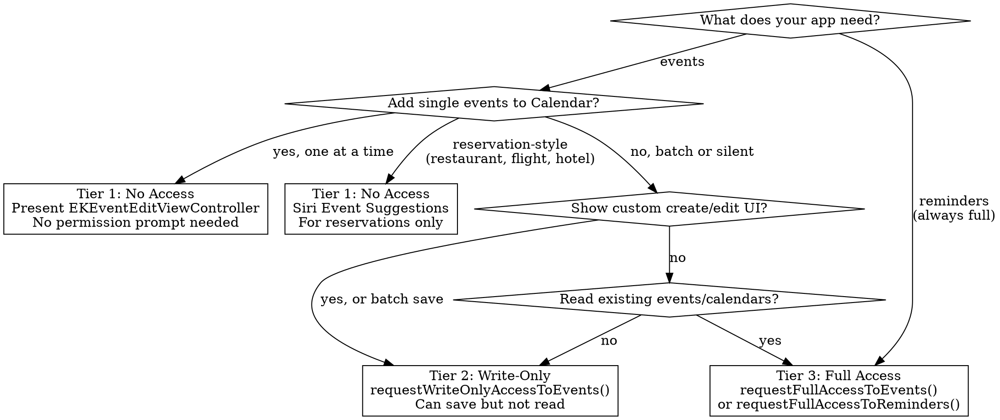

# EventKit — Discipline

## Core Philosophy

> "Request the minimum access needed, and only when it's needed."

**Mental model**: EventKit has three access tiers. Most apps need only the first (no access + system UI). Requesting more than you need means more users deny your request, and more code to maintain.

## When to Use This Skill

Use this skill when:
- Adding events or reminders to the user's calendar
- Choosing between EventKitUI, write-only, or full access
- Requesting calendar or reminder permissions
- Fetching, querying, or displaying existing events
- Migrating from pre-iOS 17 permission APIs
- Creating virtual conference extensions
- Implementing Siri Event Suggestions for reservations
- Debugging "access denied" or missing events

Do NOT use this skill for:
- Contacts framework questions (use **contacts**)
- General SwiftUI architecture (use **swiftui-architecture**)
- Background task scheduling (use **background-processing**)

## Related Skills

- **eventkit-ref** — Complete EventKit/EventKitUI API reference
- **contacts** — Contacts framework discipline skill
- **privacy-ux** — General iOS privacy patterns and Permission UX
- **extensions-widgets** — WidgetKit if combining calendar with widgets
- **background-processing** — If scheduling background calendar sync

---

## Access Tier Decision Tree



**Key rule**: Reminders ALWAYS require full access. There is no write-only tier for reminders.

---

## The Three Access Tiers

### Tier 1: No Access (Preferred)

Present `EKEventEditViewController` — it runs out-of-process on iOS 17+ and requires zero permissions.

```swift
let store = EKEventStore()
let event = EKEvent(eventStore: store)
event.title = "Team Standup"
event.startDate = startDate
event.endDate = Calendar.current.date(byAdding: .hour, value: 1, to: startDate) ?? startDate
event.timeZone = TimeZone(identifier: "America/Los_Angeles")
event.location = "Conference Room A"

let editVC = EKEventEditViewController()
editVC.event = event
editVC.eventStore = store
editVC.editViewDelegate = self
present(editVC, animated: true)
```

**Why this is best**: No permission prompt. No denial risk. System handles Calendar selection and save. Works on iOS 4+.

For reservations (restaurant, flight, hotel, event tickets), use **Siri Event Suggestions** instead — events appear in Calendar inbox without any permission. See the eventkit-ref skill for the INReservation donation pattern.

### Tier 2: Write-Only Access (iOS 17+)

Use only when you need: custom editing UI, batch saves, or silent event creation.

```swift
let store = EKEventStore()
guard try await store.requestWriteOnlyAccessToEvents() else {
    // User denied — handle gracefully
    return
}
let event = EKEvent(eventStore: store)
event.calendar = store.defaultCalendarForNewEvents  // REQUIRED for write-only
event.title = "Recurring Standup"
event.startDate = startDate
event.endDate = endDate
try store.save(event, span: .thisEvent)
```

**Write-only constraints**:
- Returns a single virtual calendar, not the user's real calendars
- Event queries return empty results
- System chooses destination calendar for created events
- Cannot read events back, even ones your app created

**Info.plist required**: `NSCalendarsWriteOnlyAccessUsageDescription`

### Tier 3: Full Access

Use only when your app's core feature requires reading, modifying, or deleting existing events.

```swift
let store = EKEventStore()
guard try await store.requestFullAccessToEvents() else { return }

// Now you can fetch events
let interval = Calendar.current.dateInterval(of: .month, for: Date())!
let predicate = store.predicateForEvents(withStart: interval.start, end: interval.end, calendars: nil)
let events = store.events(matching: predicate)
    .sorted { $0.compareStartDate(with: $1) == .orderedAscending }
```

**Info.plist required**: `NSCalendarsFullAccessUsageDescription`

For reminders:
```swift
guard try await store.requestFullAccessToReminders() else { return }
```

**Info.plist required**: `NSRemindersFullAccessUsageDescription`

---

## Anti-Patterns

| Pattern | Time Cost | Why It's Wrong | Fix |
|---------|-----------|----------------|-----|
| Requesting full access for "add to calendar" | 1-2 sprint days recovering denied users | Full access prompts are denied 30%+ of the time — users distrust reading ALL calendar data | Use EventKitUI or write-only |
| Missing Info.plist key on iOS 17+ | 1-2 hours debugging | Automatic silent denial, no crash, no error, no prompt | Add the correct usage description key |
| Missing Info.plist key on iOS 16 and below | Immediate crash | App crashes on permission request | Add `NSCalendarsUsageDescription` |
| Calling deprecated `requestAccess(to:)` on iOS 17 | Throws error | The old API throws, does not prompt | Use `requestFullAccessToEvents()` or `requestWriteOnlyAccessToEvents()` |
| Creating multiple EKEventStore instances | Stale data bugs | Objects from one store cannot be used with another | Create one store, reuse it |
| Using `Date` math instead of `DateComponents` for durations | DST bugs | Adding 3600 seconds doesn't always equal 1 hour | Use `Calendar.current.date(byAdding:)` |
| Not sorting `events(matching:)` results | Wrong display order | Results are NOT chronologically ordered | Sort with `compareStartDate(with:)` |
| Setting `dueDateComponents` with `Date` instead of `DateComponents` | Silent failure | Reminders use `DateComponents`, not `Date` | Convert via `Calendar.current.dateComponents(...)` |
| Not registering for `EKEventStoreChanged` notification | Stale UI | External Calendar changes are invisible | Register and refetch on notification |
| Ignoring `EKSpan` on recurring events | Modifying all occurrences | `.thisEvent` vs `.futureEvents` controls scope | Always choose explicitly |

---

## Reminder Patterns

Reminders ALWAYS require `requestFullAccessToReminders()`.

### Creating a Reminder

```swift
let reminder = EKReminder(eventStore: store)
reminder.title = "Review PR"
reminder.calendar = store.defaultCalendarForNewReminders()  // Required

// Due dates use DateComponents, NOT Date
if let dueDate = dueDate {
    reminder.dueDateComponents = Calendar.current.dateComponents(
        [.year, .month, .day, .hour, .minute], from: dueDate
    )
}

reminder.priority = EKReminderPriority.medium.rawValue
try store.save(reminder, commit: true)
```

### Fetching Reminders (Async)

Unlike events, reminder fetches are asynchronous:

```swift
let predicate = store.predicateForReminders(in: nil)  // nil = all calendars
let reminders = try await withCheckedThrowingContinuation { continuation in
    store.fetchReminders(matching: predicate) { reminders in
        if let reminders {
            continuation.resume(returning: reminders)
        } else {
            continuation.resume(throwing: TodayError.failedReadingReminders)
        }
    }
}
```

### Creating Reminder Lists

Reminder lists are `EKCalendar` objects filtered by entity type:

```swift
let newList = EKCalendar(for: .reminder, eventStore: store)
newList.title = "Sprint Tasks"

// Source selection matters — prefer .local or .calDAV
guard let source = store.sources.first(where: {
    $0.sourceType == .local || $0.sourceType == .calDAV
}) ?? store.defaultCalendarForNewReminders()?.source else {
    throw EventKitError.noValidSource
}

newList.source = source
try store.saveCalendar(newList, commit: true)
```

---

## Store Lifecycle

### Singleton Pattern

Create one `EKEventStore` and reuse it. Objects from one store instance cannot be used with another.

### Change Notifications

```swift
NotificationCenter.default.addObserver(
    self, selector: #selector(storeChanged),
    name: .EKEventStoreChanged, object: store
)

@objc func storeChanged(_ notification: Notification) {
    // Refetch your current date range
    // Individual objects: call refresh() — if false, refetch
}
```

### Batch Operations

```swift
// Pass commit: false for batch, then commit once
try store.save(event1, span: .thisEvent, commit: false)
try store.save(event2, span: .thisEvent, commit: false)
try store.commit()  // Atomic save
// On failure: store.reset() to rollback
```

---

## Migration from Pre-iOS 17

| Before iOS 17 | iOS 17+ Replacement |
|----------------|---------------------|
| `requestAccess(to: .event)` | `requestFullAccessToEvents()` or `requestWriteOnlyAccessToEvents()` |
| `requestAccess(to: .reminder)` | `requestFullAccessToReminders()` |
| `NSCalendarsUsageDescription` | `NSCalendarsFullAccessUsageDescription` or `NSCalendarsWriteOnlyAccessUsageDescription` |
| `NSRemindersUsageDescription` | `NSRemindersFullAccessUsageDescription` |
| `authorizationStatus == .authorized` | Check for `.fullAccess` or `.writeOnly` |

**Runtime compatibility**:
```swift
if #available(iOS 17.0, *) {
    granted = try await store.requestFullAccessToEvents()
} else {
    granted = try await store.requestAccess(to: .event)
}
```

**Keep old Info.plist keys** alongside new ones to support iOS 16 and below.

**Gotcha**: Apps built with older Xcode SDKs map both `.writeOnly` and `.fullAccess` to `.authorized`. This means an app linked against an old SDK may fail to fetch events even after users granted full access — because the app sees `.authorized` but the system gave `.writeOnly`.

---

## EventKitUI Decision Guide

| Controller | Purpose | Permission Required |
|------------|---------|---------------------|
| `EKEventEditViewController` | Create/edit events | None (iOS 17+ out-of-process) |
| `EKEventViewController` | Display event details | Full access |
| `EKCalendarChooser` | Calendar selection | Write-only or full |

**Gotcha**: `EKEventEditViewController` inherits from `UINavigationController`, not `UIViewController`. Do NOT embed it inside another navigation controller.

**Gotcha**: `EKEventViewController` inherits from `UIViewController` and CAN be pushed onto a navigation stack.

**Gotcha**: Under write-only access, `EKCalendarChooser` ignores `displayStyle` and always shows writable calendars only.

---

## Pressure Scenarios

### Scenario 1: "Just request full access, we might need it later"

**Pressure**: Product manager asks for full access "just in case."

**Why resist**: Full access prompts are denied 30%+ of the time. Write-only or EventKitUI gets you event creation with near-zero denials. You can always upgrade later if a reading feature is added.

**Response**: "Full access shows a scary prompt about reading ALL calendar data. For adding events, EventKitUI needs no prompt at all. Let's start there and upgrade if we ship a feature that reads events."

### Scenario 2: "The deprecated API still works, we'll migrate later"

**Pressure**: Deadline pressure to skip migration from `requestAccess(to:)`.

**Why resist**: On iOS 17, calling `requestAccess(to: .event)` throws an error — no prompt, no access, broken feature. Users on iOS 17+ get a silent failure.

**Response**: "The deprecated API throws on iOS 17. It's not 'deprecated but works' — it's broken. The fix is a 3-line `#available` check."

### Scenario 3: "Just create a new EKEventStore for each screen"

**Pressure**: Different view controllers each create their own store for isolation.

**Why resist**: Objects from one store cannot be used with another. Events fetched from store A cannot be saved by store B. Change notifications only fire on the store that's registered.

**Response**: "EventKit requires a single shared store. Objects are bound to the store that created them. Create one and inject it."

---

## Error Handling

Key `EKErrorDomain` codes to handle:

| Code | Meaning | Fix |
|------|---------|-----|
| `eventStoreNotAuthorized` | No permission | Check and request access first |
| `noCalendar` | Calendar not set on event | Set `event.calendar` before save |
| `noStartDate` / `noEndDate` | Missing dates | Set both before save |
| `datesInverted` | End before start | Validate date order |
| `calendarReadOnly` / `calendarIsImmutable` | Can't write to this calendar | Use `allowsContentModifications` check |
| `objectBelongsToDifferentStore` | Cross-store usage | Use single store instance |
| `recurringReminderRequiresDueDate` | Recurring reminder missing due date | Set `dueDateComponents` |

---

## Resources

**WWDC**: 2023-10052, 2020-10197

**Docs**: /eventkit, /eventkitui, /technotes/tn3152, /technotes/tn3153

**Skills**: eventkit-ref, contacts, privacy-ux, extensions-widgets
