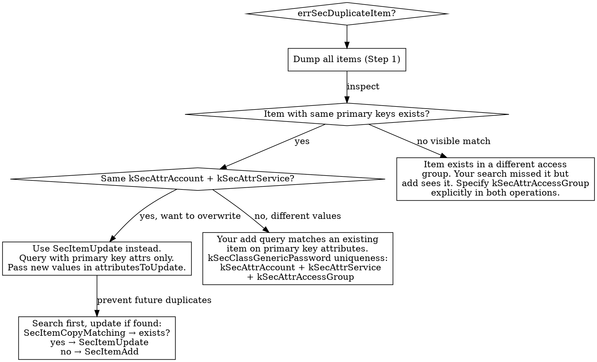
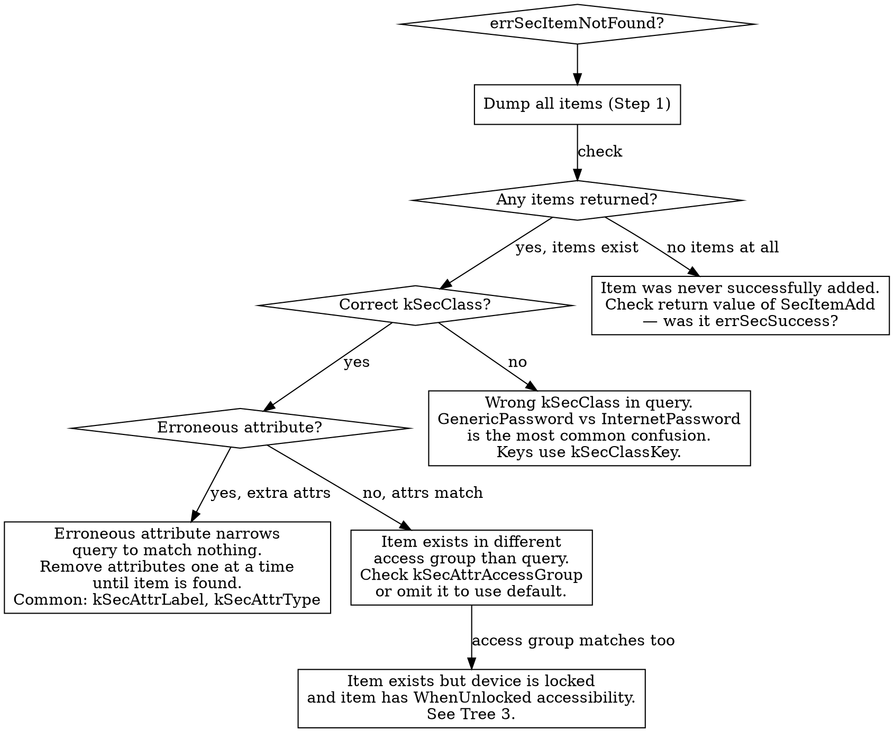
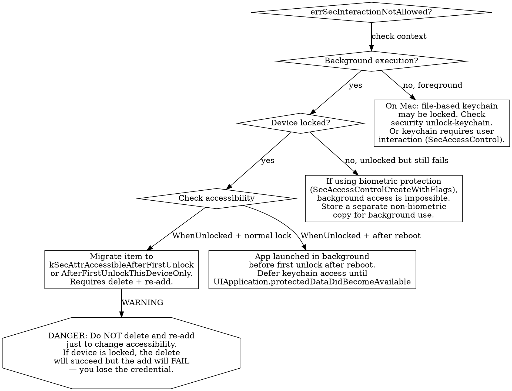
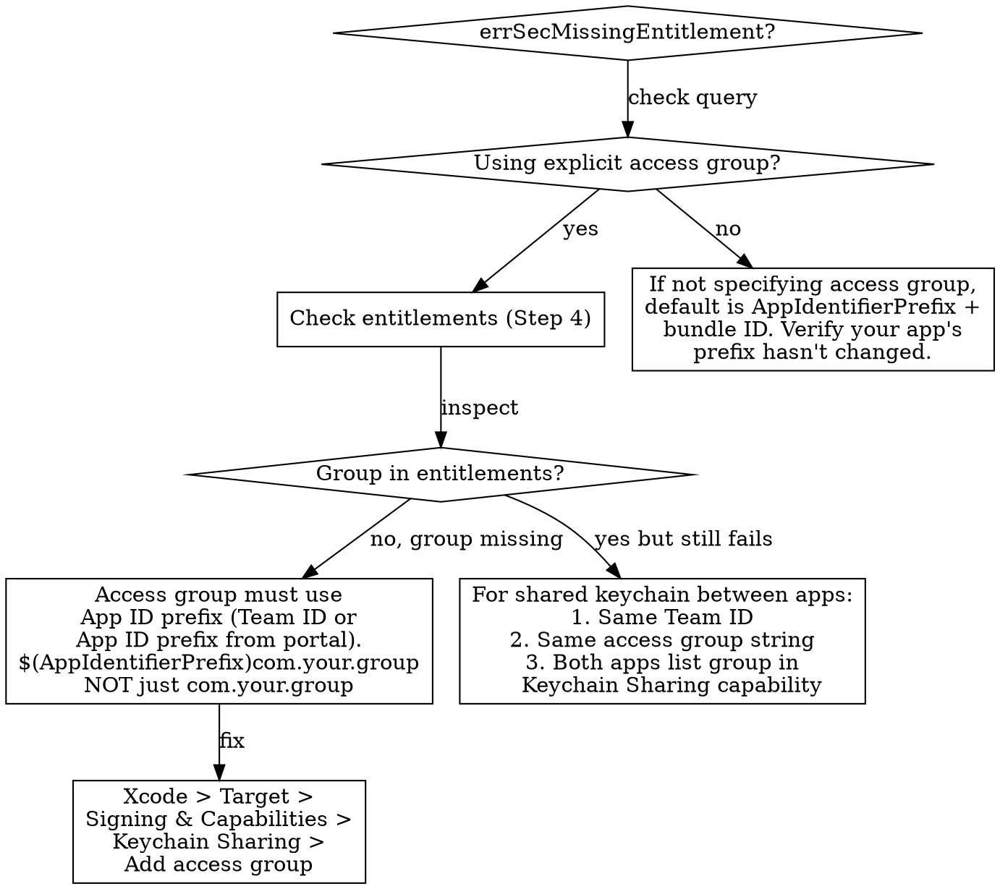
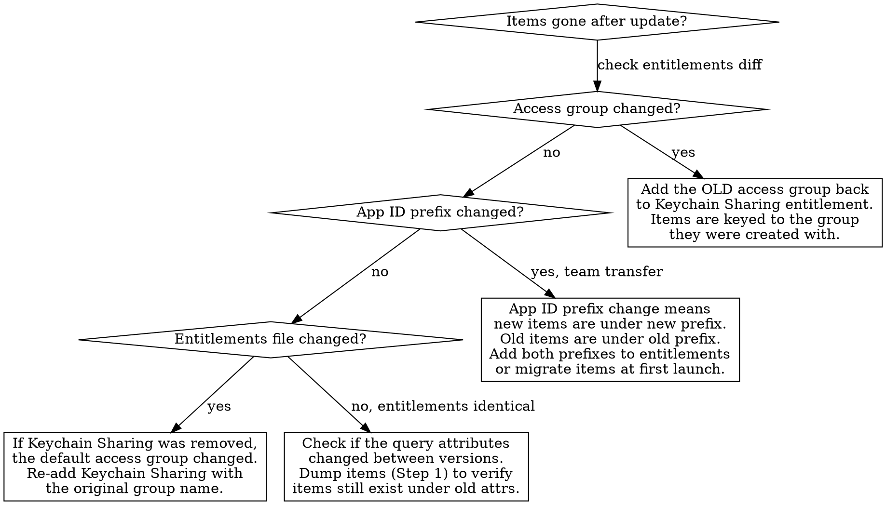
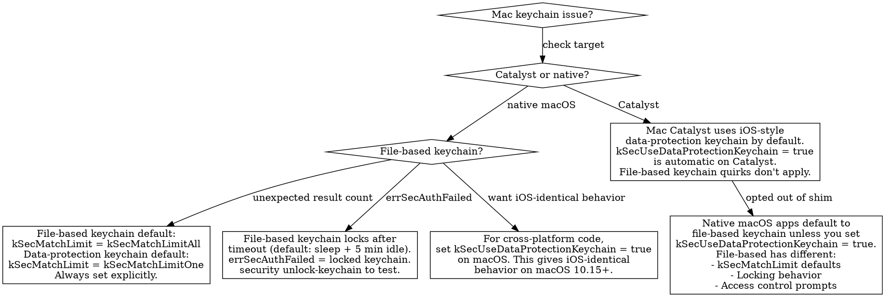
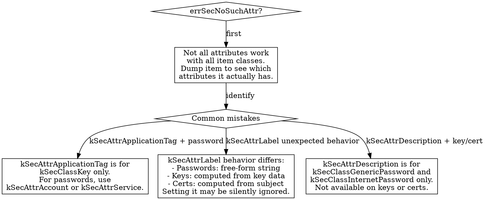

# Keychain Diagnostics

Systematic troubleshooting for Security framework failures: uniqueness constraint violations, query mismatches, data protection timing, access group entitlements, disappearing items after updates, and Mac shim behavior differences.

## Overview

**Core Principle**: When keychain operations fail, the problem is usually:
1. **Uniqueness constraint mismatch** (errSecDuplicateItem) — 25%
2. **Query attribute confusion** (errSecItemNotFound) — 25%
3. **Data protection / background timing** (errSecInteractionNotAllowed) — 20%
4. **Access group / entitlement mismatch** (errSecMissingEntitlement) — 15%
5. **Mac shim behavior differences** — 10%
6. **Lost items after app update** (entitlement or App ID prefix change) — 5%

**Always dump existing items and compare attributes BEFORE changing keychain code.**

## Red Flags

Symptoms that indicate keychain-specific issues:

| Symptom | Likely Cause |
|---------|--------------|
| errSecDuplicateItem when query returned not found | Non-unique attributes in add query — uniqueness is per-class + primary key attributes, not per your full query |
| errSecItemNotFound but item was just added | Wrong `kSecClass`, erroneous attribute narrowing query, or access group mismatch |
| errSecInteractionNotAllowed in background | `kSecAttrAccessibleWhenUnlocked` (default) + device locked + background execution |
| errSecMissingEntitlement | Access group not listed in keychain-access-groups entitlement |
| errSecNoSuchAttr | Attribute not supported for item class (e.g. `kSecAttrApplicationTag` on `kSecClassGenericPassword`) |
| errSecAuthFailed on Mac | File-based keychain locked or timed out |
| Items gone after app update | Access group or entitlement changed between versions |
| Items gone after team change | App ID prefix changed — items keyed to old prefix are inaccessible |
| SecItemDelete deleted everything | `kSecMatchLimit` is irrelevant for delete — it deletes ALL matching items |
| Keychain works in simulator, fails on device | Simulator does not enforce data protection — device does |

## Anti-Rationalization

| Rationalization | Why It Fails | Time Cost |
|----------------|--------------|-----------|
| "The wrapper handles it" | Wrappers hide uniqueness constraints. When errSecDuplicateItem happens, you can't debug what you can't see. You end up reading the wrapper source. | 30+ min unwrapping the wrapper |
| "I'll just delete and re-add" | Loses item metadata, breaks iCloud Keychain sync state, and if the delete query is broader than intended, silently deletes other items too. | 1-2 hours debugging missing credentials |
| "UserDefaults is fine for this one token" | UserDefaults is unencrypted, backed up to iCloud, visible to MDM profiles, and readable via device backup extraction. One security audit catches it. | Hours migrating to keychain after rejection |
| "errSecItemNotFound means it's not there" | It means your query didn't match. The item may exist with different attributes than you're searching for. Dump all items to check. | 30-60 min rewriting add logic when the item already exists |
| "I'll fix the keychain code after launch" | Keychain bugs are silent data loss. Users lose credentials after an update, can't log in, and have no recovery path. You find out from 1-star reviews. | Days of emergency patches + user trust damage |

## Mandatory First Steps

Before changing keychain code, run these diagnostics:

### Step 1: Dump All Items of the Relevant Class

```swift
let query: [String: Any] = [
    kSecClass as String: kSecClassGenericPassword,
    kSecMatchLimit as String: kSecMatchLimitAll,
    kSecReturnAttributes as String: true,
    kSecReturnRef as String: true
]
var result: AnyObject?
let status = SecItemCopyMatching(query as CFDictionary, &result)
if status == errSecSuccess, let items = result as? [[String: Any]] {
    for item in items {
        print(item)
    }
}
```

This reveals every item of that class your app can see — including ones you forgot about.

### Step 2: Compare Attributes Against Your Query

Check each attribute in your add/update/search query against the dump output. Common mismatches:
- `kSecAttrAccount` vs `kSecAttrService` — which one are you using for the key?
- `kSecAttrAccessGroup` — are you specifying one that differs from the default?
- Extra attributes narrowing the search (e.g. `kSecAttrLabel` you set on add but omit on search)

### Step 3: Check Accessibility Class vs Device Lock State

```swift
// In your dump, look for:
// kSecAttrAccessible: kSecAttrAccessibleWhenUnlocked  (default — fails when locked)
// kSecAttrAccessible: kSecAttrAccessibleAfterFirstUnlock  (survives background)
```

If the app accesses keychain in background (push notification handlers, background fetch), `WhenUnlocked` will fail on a locked device.

### Step 4: Verify Access Group Entitlements

```bash
codesign -d --entitlements - /path/to/YourApp.app 2>&1 | grep keychain-access-groups
```

The access group in your query must appear in this list. The default group is `$(AppIdentifierPrefix)$(CFBundleIdentifier)`.

## Decision Trees

### Tree 1: errSecDuplicateItem



**Uniqueness constraints by class**:

| Class | Primary Key Attributes |
|-------|----------------------|
| kSecClassGenericPassword | kSecAttrAccount + kSecAttrService + kSecAttrAccessGroup |
| kSecClassInternetPassword | kSecAttrAccount + kSecAttrSecurityDomain + kSecAttrServer + kSecAttrProtocol + kSecAttrAuthenticationType + kSecAttrPort + kSecAttrPath |
| kSecClassCertificate | kSecAttrCertificateType + kSecAttrIssuer + kSecAttrSerialNumber |
| kSecClassKey | kSecAttrKeyClass + kSecAttrKeyType + kSecAttrApplicationLabel + kSecAttrApplicationTag + kSecAttrEffectiveKeySize |

### Tree 2: errSecItemNotFound



### Tree 3: errSecInteractionNotAllowed



### Tree 4: errSecMissingEntitlement



### Tree 5: Lost Keychain Items After App Update



### Tree 6: Mac-Specific Issues



### Tree 7: errSecNoSuchAttr



## Quick Reference Table

| Symptom | Check | Fix |
|---------|-------|-----|
| errSecDuplicateItem | Dump items (Step 1), compare primary key attrs | Use SecItemUpdate or query-before-add pattern |
| errSecItemNotFound | Dump items, verify kSecClass + attributes match | Remove erroneous attributes, fix class |
| errSecInteractionNotAllowed in background | Check kSecAttrAccessible value | Migrate to AfterFirstUnlock (delete + re-add while unlocked) |
| errSecInteractionNotAllowed after reboot | Check if first unlock happened | Defer access until protectedDataDidBecomeAvailable |
| errSecMissingEntitlement | `codesign -d --entitlements -` for access groups | Add group to Keychain Sharing capability |
| errSecNoSuchAttr | Check attribute compatibility with item class | Use correct attribute for the class |
| errSecAuthFailed on Mac | Check if file-based keychain is locked | `security unlock-keychain` or use data-protection keychain |
| Items gone after update | Diff entitlements between versions | Restore old access group, migrate items |
| Items gone after team change | Check App ID prefix change | Add both prefixes to entitlements |
| Delete removed too many items | Review delete query specificity | Always specify all primary key attrs in delete query |
| Works in simulator, fails on device | Check accessibility class | Simulator ignores data protection — test on device |
| Inconsistent Mac vs iOS behavior | Check kSecUseDataProtectionKeychain | Set to true for consistent cross-platform behavior |
| Query returns wrong item | Check kSecMatchLimit | Always set explicitly — defaults differ by keychain type |
| Biometric item fails in background | Check SecAccessControl flags | Store separate non-biometric copy for background |
| SecItemAdd returns errSecSuccess but search fails | Check if access groups differ between add and search | Specify kSecAttrAccessGroup explicitly in both |

## Pressure Scenarios

### Scenario 1: "Users can't log in after the update — just clear and re-store the token"

**Context**: Version 2.1 shipped with a Keychain Sharing entitlement change. Users updating from 2.0 lose their auth tokens. Support tickets are flooding in.

**Pressure**: "Just delete the old item and store a new one on first launch."

**Reality**: The old item is inaccessible because the access group changed — SecItemDelete can't find it either. The "delete and re-add" approach silently does nothing. Meanwhile, the real fix is restoring the old access group in entitlements so existing items are readable again, then migrating to the new group.

**Correct action**: Add the old access group back to the Keychain Sharing entitlement. On first launch, read from old group, write to new group, delete from old group. Ship as 2.1.1.

**Push-back template**: "The delete won't work either — the old items are under the old access group that we can no longer read. We need to add the old access group back to our entitlements so we can read and migrate those items. This is a 30-minute fix, not a redesign."

### Scenario 2: "errSecInteractionNotAllowed in push handler — just change to AfterFirstUnlock"

**Context**: Background push notification handler reads an auth token from keychain to call an API. Fails with errSecInteractionNotAllowed when device is locked.

**Pressure**: "Just change the accessibility to AfterFirstUnlock. Quick fix."

**Reality**: Changing accessibility requires deleting the old item and adding a new one with the new accessibility class. If you do this in the push handler while the device is locked, the delete succeeds (it doesn't read data) but the add fails (AfterFirstUnlock still requires first unlock, and if the device just rebooted, first unlock hasn't happened). You just deleted the user's credential.

**Correct action**: Change accessibility in foreground code (app launch, `protectedDataDidBecomeAvailable`). Never migrate keychain items in background execution paths.

**Push-back template**: "We can't change accessibility in the push handler — the delete works but the re-add can fail if the device rebooted without unlocking. We need to migrate in the foreground on next app launch, and handle the push handler failure gracefully until then."

### Scenario 3: "The keychain wrapper handles all this — just use it"

**Context**: Team uses a third-party keychain wrapper (KeychainAccess, Valet, etc.). errSecDuplicateItem keeps happening despite the wrapper's "upsert" method.

**Pressure**: "The wrapper documentation says it handles duplicates. Must be a bug in the wrapper."

**Reality**: The wrapper's upsert does query-then-add or query-then-update. But if your query attributes don't match the uniqueness constraints of the item class, the search returns not-found while the add hits the existing item's primary key. The wrapper can't fix a query that uses the wrong attributes. You need to understand what makes items unique and ensure your wrapper configuration matches.

**Correct action**: Dump all items (Step 1) to see what exists. Compare the wrapper's query attributes against the item class uniqueness constraints table. Fix the wrapper configuration to query on primary key attributes.

**Push-back template**: "The wrapper works correctly — it's our configuration that doesn't match the keychain's uniqueness constraints. Let me dump the existing items and compare against our query. This is a 10-minute diagnosis."

## Checklist

Before declaring a keychain issue fixed:

- [ ] Dumped all items of relevant class — understand what exists
- [ ] Verified kSecClass matches the item type (GenericPassword vs InternetPassword vs Key)
- [ ] Checked primary key attributes for uniqueness constraints
- [ ] Confirmed kSecAttrAccessible suits the execution context (foreground vs background)
- [ ] Verified access group in entitlements matches query
- [ ] Tested on device (not just simulator — simulator ignores data protection)
- [ ] Tested after device reboot + lock for background scenarios
- [ ] If migrating accessibility: migration runs in foreground only, never background
- [ ] If sharing between apps: both apps have same access group in Keychain Sharing

## Resources

**Docs**: /security/keychain_services, /security/keychain_services/keychain_items, /security/errSecDuplicateItem, /security/errSecItemNotFound, /security/errSecInteractionNotAllowed

**Reference**: Quinn "The Eskimo" — SecItem Pitfalls and Best Practices (Apple Developer Forums), Keychain Items Fundamentals (Apple TN3137)

**Skills**: axiom-keychain, axiom-keychain-ref
