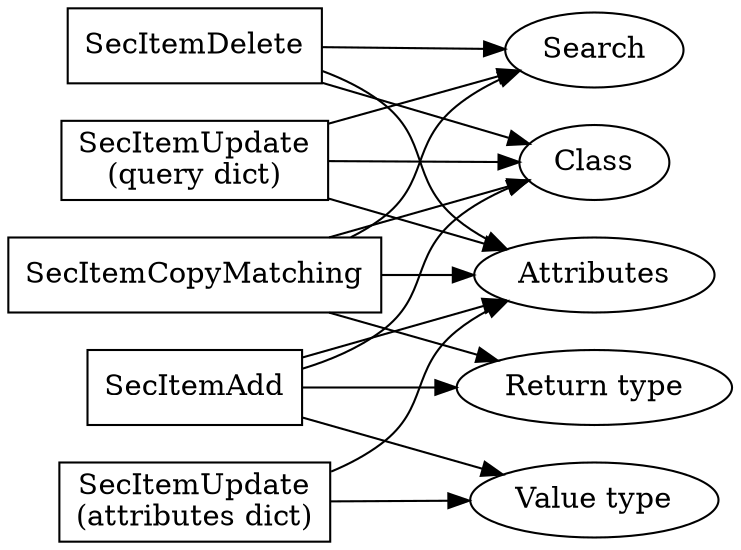
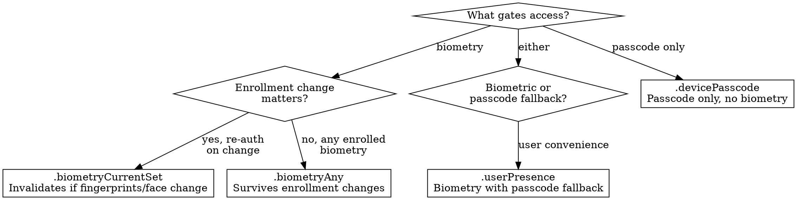

# Keychain Services

Secure credential storage, SecItem API mental model, uniqueness constraints, data protection classes, biometric access control, keychain sharing, and Mac keychain differences for iOS/macOS apps.

## When to Use This Skill

Use when you need to:
- ☑ Store tokens, passwords, API keys, or cryptographic keys securely
- ☑ Debug errSecDuplicateItem, errSecItemNotFound, or errSecInteractionNotAllowed
- ☑ Choose the right kSecAttrAccessible level for your use case
- ☑ Add biometric or passcode protection to a keychain item
- ☑ Share credentials between apps or app extensions via access groups
- ☑ Migrate from UserDefaults/@AppStorage to keychain for sensitive data
- ☑ Understand why SecItemCopyMatching returns something different than expected
- ☑ Store or retrieve keychain items from a background context

## Example Prompts

"How do I store an auth token in the keychain?"
"errSecDuplicateItem when saving to keychain but the item doesn't exist"
"My keychain read fails in background refresh"
"How do I add Face ID protection to a keychain item?"
"Share keychain items between my app and widget extension"
"What's the difference between kSecAttrAccessibleAfterFirstUnlock and WhenUnlocked?"
"SecItemCopyMatching returns errSecItemNotFound but I just saved it"
"How do I use the keychain on macOS with Catalyst?"
"My keychain wrapper is returning nil — how do I debug this?"
"errSecInteractionNotAllowed in background task"

## Red Flags

Signs you're making this harder than it needs to be:

- ❌ Using a keychain wrapper without understanding SecItem — Wrappers hide the 4-function model and introduce their own bugs. Quinn "The Eskimo!" explicitly warns: most wrapper issues stem from the wrapper, not the keychain. Learn the model first.
- ❌ Storing tokens in UserDefaults or @AppStorage — These are plist files readable by anyone with device access (or a backup). Credentials belong in the keychain. No exceptions.
- ❌ Force-unwrapping SecItemCopyMatching results — The return type depends on which kSecReturn* flags you passed. A mismatch gives you a surprising type, not your data.
- ❌ Not specifying kSecAttrAccessible — Defaults to kSecAttrAccessibleWhenUnlocked, which fails in background execution. If your app does background refresh, push processing, or VoIP, this will bite you.
- ❌ Catching errSecDuplicateItem by deleting then re-adding — This creates a race condition and destroys metadata (creation date, access control). Use SecItemUpdate instead.
- ❌ Using kSecMatchLimitAll without understanding delete semantics — SecItemDelete has no kSecMatchLimit; it deletes ALL matching items. One careless query can wipe credentials.
- ❌ Ignoring errSecDuplicateItem — "It worked last time" means you have a query/uniqueness mismatch. This is the #1 keychain bug.

## The 4-Function Model

Quinn's mental model: the keychain is a database with per-class tables. The four SecItem functions map directly to SQL.

| SecItem Function | SQL Equivalent | Purpose |
|---|---|---|
| SecItemAdd | INSERT | Create a new item |
| SecItemCopyMatching | SELECT | Read one or more items |
| SecItemUpdate | UPDATE | Modify an existing item |
| SecItemDelete | DELETE | Remove items |

### Per-Class Tables

Each item class is a separate table with different columns (attributes):

| Class | kSecClass Value | Typical Use |
|---|---|---|
| Generic password | kSecClassGenericPassword | App credentials, tokens, secrets |
| Internet password | kSecClassInternetPassword | URL-associated credentials |
| Certificate | kSecClassCertificate | X.509 certificates |
| Key | kSecClassKey | Cryptographic keys |
| Identity | kSecClassIdentity | Certificate + private key pair |

For most iOS apps, you only need `kSecClassGenericPassword`. Internet passwords are for credentials tied to a specific server/protocol/port. Certificates and keys are for custom cryptographic operations.

## Uniqueness Constraints

This is where most keychain bugs originate. Each class has a **primary key** — a combination of attributes that must be unique.

### Generic Password Primary Key

```
kSecAttrService + kSecAttrAccount + kSecAttrAccessGroup
```

### Internet Password Primary Key

```
kSecAttrServer + kSecAttrAccount + kSecAttrPort
  + kSecAttrProtocol + kSecAttrAuthenticationType + kSecAttrSecurityDomain
  + kSecAttrAccessGroup
```

See axiom-keychain-ref for the full attribute breakdown per class.

### The errSecDuplicateItem Trap

You call SecItemCopyMatching with a query and get errSecItemNotFound. You call SecItemAdd with what you think is the same item. You get errSecDuplicateItem. How?

**The query attributes don't match the uniqueness attributes.** Your copy query might search by `kSecAttrService` alone, but uniqueness is `service + account + accessGroup`. An item exists with the same service but a different account — your query misses it, but your add hits the uniqueness constraint on the combination.

```swift
// This query finds nothing (searching by service + label, but label isn't a primary key)
let copyQuery: [String: Any] = [
    kSecClass as String: kSecClassGenericPassword,
    kSecAttrService as String: "com.app.auth",
    kSecAttrLabel as String: "auth-token",
    kSecReturnData as String: true
]
// Result: errSecItemNotFound (no item has this label)

// This add fails — an item with service "com.app.auth" + account "user-token"
// already exists. The add hits the primary key (service + account + accessGroup).
let addQuery: [String: Any] = [
    kSecClass as String: kSecClassGenericPassword,
    kSecAttrService as String: "com.app.auth",
    kSecAttrAccount as String: "user-token",
    kSecValueData as String: tokenData
]
// Result: errSecDuplicateItem
```

**Fix**: Always specify ALL primary key attributes in every query. For generic passwords, always include `kSecAttrService` AND `kSecAttrAccount`.

### The Safe Add-or-Update Pattern

```swift
func saveToKeychain(service: String, account: String, data: Data) -> OSStatus {
    let query: [String: Any] = [
        kSecClass as String: kSecClassGenericPassword,
        kSecAttrService as String: service,
        kSecAttrAccount as String: account
    ]

    let attributes: [String: Any] = [
        kSecValueData as String: data
    ]

    // Try update first
    var status = SecItemUpdate(query as CFDictionary, attributes as CFDictionary)

    if status == errSecItemNotFound {
        // Item doesn't exist — add it
        var addQuery = query
        addQuery[kSecValueData as String] = data
        status = SecItemAdd(addQuery as CFDictionary, nil)
    }

    return status
}
```

This is safer than delete-then-add because it preserves item metadata and avoids race conditions.

## Parameter Block Anatomy

Every SecItem function takes a dictionary. That dictionary contains properties from 5 groups, but which groups are valid depends on which function you're calling.

### The 5 Property Groups

| Group | Prefix/Pattern | Purpose |
|---|---|---|
| Class | kSecClass | Which table (generic password, key, etc.) |
| Attributes | kSecAttr* | Column values (service, account, label) |
| Search | kSecMatch* | Query modifiers (limit, case sensitivity) |
| Return type | kSecReturn* | What shape the result takes |
| Value type | kSecValue* | The actual data/reference |

### Which Groups Apply to Which Function



### kSecMatchLimit Defaults

This is a documented pitfall from Quinn's thread. The default value of `kSecMatchLimit` depends on context:

| Context | Default kSecMatchLimit | Behavior |
|---|---|---|
| SecItemCopyMatching with kSecReturnData | kSecMatchLimitOne | Returns one item |
| SecItemCopyMatching with kSecReturnAttributes | kSecMatchLimitOne | Returns one item |
| SecItemCopyMatching with kSecReturnRef | kSecMatchLimitOne | Returns one item |
| SecItemDelete | No limit concept | Deletes ALL matches |

SecItemDelete has no `kSecMatchLimit` parameter. It deletes every item matching your query. If your query is broad (only `kSecClass` and `kSecAttrService`), you will delete every item for that service across all accounts.

### Return Type Determines Output Type

| kSecReturn* Flags | Output Type |
|---|---|
| kSecReturnData only | CFData (the raw secret) |
| kSecReturnAttributes only | CFDictionary (item metadata) |
| kSecReturnRef only | SecKey / SecCertificate / SecIdentity |
| kSecReturnData + kSecReturnAttributes | CFDictionary (metadata + kSecValueData key) |
| kSecReturnPersistentRef | CFData (persistent reference, survives keychain resets) |

Force-casting the result to the wrong type is a common crash source. Always match your cast to your return flags.

## Accessibility and Data Protection

`kSecAttrAccessible` controls when the keychain item's decryption key is available. This maps directly to the device's data protection classes.

| Level | Available When | Use Case |
|---|---|---|
| kSecAttrAccessibleWhenUnlocked | Device unlocked | Default. UI-driven credentials |
| kSecAttrAccessibleWhenUnlockedThisDeviceOnly | Device unlocked, no backup | High-security tokens |
| kSecAttrAccessibleAfterFirstUnlock | After first unlock until reboot | Background refresh, push processing |
| kSecAttrAccessibleAfterFirstUnlockThisDeviceOnly | After first unlock, no backup | Background + high security |
| kSecAttrAccessibleWhenPasscodeSetThisDeviceOnly | Passcode set + unlocked | Biometric-gated items |

### The Background Execution Trap

This is the single most common keychain failure in production. Your app works perfectly during normal use but fails with `errSecInteractionNotAllowed` (-25308) during background refresh.

**The dangerous pattern**:

```swift
// Background task tries to read a token
let query: [String: Any] = [
    kSecClass as String: kSecClassGenericPassword,
    kSecAttrService as String: "com.app.auth",
    kSecAttrAccount as String: "refresh-token",
    kSecReturnData as String: true
    // Item was stored with default WhenUnlocked accessibility (set at add time)
]
var result: AnyObject?
let status = SecItemCopyMatching(query as CFDictionary, &result)
// status == errSecInteractionNotAllowed when device is locked

// Developer's instinct: "the token is corrupted, delete and re-auth"
if status != errSecSuccess {
    SecItemDelete(query as CFDictionary)  // DELETES THE CREDENTIAL
}
```

From Quinn: "This is a lesson that, once learnt, is never forgotten!"

The item is fine. The device is locked, so the decryption key isn't available. The developer's error handler destroys a perfectly valid credential because it misinterprets the error.

**The fix**: Store tokens needed in background with `kSecAttrAccessibleAfterFirstUnlock`:

```swift
let addQuery: [String: Any] = [
    kSecClass as String: kSecClassGenericPassword,
    kSecAttrService as String: "com.app.auth",
    kSecAttrAccount as String: "refresh-token",
    kSecAttrAccessible as String: kSecAttrAccessibleAfterFirstUnlock,
    kSecValueData as String: tokenData
]
```

And never delete on `errSecInteractionNotAllowed` — it means "try again when the device is unlocked", not "this item is broken".

## Access Control and Biometrics

`SecAccessControl` gates individual keychain items behind biometric authentication or device passcode.

### Creating a Biometric-Gated Item

```swift
var error: Unmanaged<CFError>?
guard let accessControl = SecAccessControlCreateWithFlags(
    nil,
    kSecAttrAccessibleWhenPasscodeSetThisDeviceOnly,
    .biometryCurrentSet,
    &error
) else {
    // Handle error — usually means device has no passcode
    return
}

let query: [String: Any] = [
    kSecClass as String: kSecClassGenericPassword,
    kSecAttrService as String: "com.app.auth",
    kSecAttrAccount as String: "biometric-secret",
    kSecAttrAccessControl as String: accessControl,
    kSecValueData as String: secretData
]

let status = SecItemAdd(query as CFDictionary, nil)
```

### Access Control Flag Selection



| Flag | Behavior | When to Use |
|---|---|---|
| .biometryCurrentSet | Invalidated if biometry enrollment changes | Banking, medical — re-auth on new fingerprint/face |
| .biometryAny | Survives enrollment changes | Convenience auth, app lock |
| .userPresence | Biometry with passcode fallback | Most common choice — works even if biometry fails |
| .devicePasscode | Passcode only, no biometry prompt | Accessibility-first or biometry-averse users |

### LAContext for Reuse Duration

By default, each keychain read prompts for biometric auth. To allow reuse within a time window:

```swift
let context = LAContext()
context.touchIDAuthenticationAllowableReuseDuration = 10  // seconds

let query: [String: Any] = [
    kSecClass as String: kSecClassGenericPassword,
    kSecAttrService as String: "com.app.auth",
    kSecAttrAccount as String: "biometric-secret",
    kSecUseAuthenticationContext as String: context,
    kSecReturnData as String: true
]
```

After one successful biometric auth, subsequent reads within 10 seconds skip the prompt. Maximum reuse duration is `LATouchIDAuthenticationMaximumAllowableReuseDuration` (5 minutes on current hardware).

## Sharing and Access Groups

### Keychain Access Groups vs App Groups

| Feature | Keychain Access Groups | App Groups |
|---|---|---|
| Entitlement | keychain-access-groups | com.apple.security.application-groups |
| Prefix | Team ID (auto-added) | No prefix (you control full string) |
| Scope | Keychain items only | Files, UserDefaults, AND keychain |
| Setup | Signing & Capabilities → Keychain Sharing | Signing & Capabilities → App Groups |

### How Access Groups Work

Every keychain item belongs to exactly one access group. If you don't specify `kSecAttrAccessGroup`, the item goes into your app's default access group (`TEAMID.your.bundle.id`).

To share between apps or extensions:

1. Add the same keychain access group to both targets (Signing & Capabilities → Keychain Sharing)
2. Specify the group when writing:

```swift
let query: [String: Any] = [
    kSecClass as String: kSecClassGenericPassword,
    kSecAttrService as String: "com.app.shared-auth",
    kSecAttrAccount as String: "user-token",
    kSecAttrAccessGroup as String: "TEAMID.com.app.shared",
    kSecValueData as String: tokenData
]
```

### The Team ID Prefix Trap

Keychain access groups get the **Team ID** automatically prepended by the system. You write `com.app.shared` in the entitlement, the system stores it as `ABCD1234.com.app.shared`.

But `kSecAttrAccessGroup` in your code must include the prefix: `"ABCD1234.com.app.shared"`.

App Groups do NOT get this prefix. If you're using an App Group for keychain sharing (via `kSecAttrAccessGroup` with a `group.` prefix), use the full string as-is.

### The App ID Prefix Change Trap

From Quinn's pitfalls: if an app changes its App ID prefix (Team ID), it loses access to all existing keychain items. This happens when:
- Transferring an app between developer accounts
- Certain legacy App ID configurations

There is no recovery. The items are orphaned. Plan for this in migration logic — detect the condition and prompt the user to re-authenticate.

## Mac Keychain Differences

macOS has two keychain systems. Understanding the difference prevents "it works on iOS but fails on Mac" bugs.

### File-Based Keychain (Legacy)

The traditional macOS keychain (`~/Library/Keychains/login.keychain-db`):
- User-visible in Keychain Access.app
- Supports ACLs (access control lists) for per-app access
- Items can be shared across all apps by default
- No data protection classes

### Data Protection Keychain (Modern)

Aligned with iOS keychain behavior (from TN3137):
- Not visible in Keychain Access.app (prior to macOS 15)
- Uses data protection classes (kSecAttrAccessible)
- Items scoped to access groups (same as iOS)
- Required for Catalyst and SwiftUI multiplatform apps

### Always Use Data Protection Keychain

```swift
let query: [String: Any] = [
    kSecClass as String: kSecClassGenericPassword,
    kSecAttrService as String: "com.app.auth",
    kSecAttrAccount as String: "token",
    kSecUseDataProtectionKeychain as String: true,  // Critical for Mac
    kSecValueData as String: tokenData
]
```

Set `kSecUseDataProtectionKeychain: true` for ALL keychain operations on macOS. This gives you consistent behavior across iOS, macOS, Catalyst, and Mac Catalyst.

Without this flag on macOS, items go into the file-based keychain where:
- Access control behaves differently (ACLs instead of data protection)
- Sharing semantics change (any app can read by default)
- Items appear in Keychain Access.app (user confusion)
- Migration between file-based and data-protection keychains is one-way and manual

## Anti-Rationalization

| Rationalization | Why It Fails | Time Cost |
|---|---|---|
| "UserDefaults is fine for tokens, it's a private app" | Backup extraction, device access tools, and MDM profiles all read UserDefaults. The keychain is encrypted at the hardware level. | 4-8 hours for a security incident response |
| "I'll wrap it in a KeychainHelper class to simplify things" | Wrappers abstract the 4-function model, hiding uniqueness and parameter block semantics. When they break, you debug the wrapper AND the keychain. | 2-4 hours debugging a wrapper bug vs 30 min learning SecItem |
| "Delete then re-add is simpler than update" | Destroys creation date, access control settings, and persistent references. Creates a TOCTOU race if another process reads between delete and add. | 1-2 hours debugging intermittent failures |
| "WhenUnlocked is secure enough" | Correct for UI-driven reads. Fatal for background refresh, push processing, silent notifications. errSecInteractionNotAllowed at 3 AM with no user to unlock. | 2-6 hours diagnosing a background failure that only reproduces on locked devices |
| "I tested it on Simulator, it works" | Simulator has no Secure Enclave, no data protection enforcement, and different keychain behavior. Biometric items always succeed. Accessibility constraints are not enforced. | 4-8 hours debugging device-only failures |
| "errSecInteractionNotAllowed means the token is corrupted" | It means the device is locked. The token is fine. Deleting it destroys a valid credential and forces re-authentication. | 15-30 min user complaint cycle per incident |
| "Access groups are too complicated, I'll use App Groups for everything" | App Groups add keychain sharing as a side effect, but the semantics differ from keychain access groups. Team ID prefix behavior is different. Mixing both creates invisible access scope bugs. | 2-4 hours debugging cross-target access failures |

## Pressure Scenarios

### Scenario 1: "Just store it in UserDefaults for now"

**Context**: Sprint deadline, new feature requires storing an API token. Keychain code looks complicated.

**Pressure**: "UserDefaults is faster to implement. We'll move it to keychain in the security sprint."

**Reality**: Moving from UserDefaults to keychain later requires migration code (read from UserDefaults, write to keychain, delete from UserDefaults, handle partial migration). That migration itself becomes a security surface — the token exists in both locations during the transition. The "security sprint" never happens because there's always a higher-priority feature. Meanwhile, the token is in plaintext in the app's plist, included in every iCloud backup.

**Correct action**: Use the safe add-or-update pattern from this skill. It's 15 lines of code. The SecItem call itself is not meaningfully harder than UserDefaults — the perceived complexity comes from not understanding the model.

**Push-back template**: "The keychain call is 15 lines, same as UserDefaults. Doing it in UserDefaults now means writing migration code later — which is actually harder. Let me write it correctly the first time."

### Scenario 2: "Delete the keychain item when we get an error"

**Context**: Background refresh fails intermittently with errSecInteractionNotAllowed. The quick fix: delete the "corrupted" token and force re-login.

**Pressure**: "Users are complaining about stale data. Just clear the token and re-auth on next launch."

**Reality**: The token is not corrupted. The device is locked and `kSecAttrAccessibleWhenUnlocked` prevents access. Deleting it forces every user to re-authenticate after any background failure — which is every night when their phone locks. The actual fix is changing the accessibility level to `kSecAttrAccessibleAfterFirstUnlock`, which takes one line.

**Correct action**: Change the item's accessibility to `kSecAttrAccessibleAfterFirstUnlock`. For existing items already stored with the wrong level, add a one-time migration on app launch (read, delete, re-add with correct accessibility).

**Push-back template**: "The token isn't corrupted — the device is locked. Deleting it forces every user to re-login every morning. The fix is one line: change the accessibility class to AfterFirstUnlock. I can also add a migration for existing users."

### Scenario 3: "Use this keychain wrapper library, everyone uses it"

**Context**: Team is integrating a popular open-source keychain wrapper to "simplify" keychain access.

**Pressure**: "It has 5,000 GitHub stars and handles all the edge cases."

**Reality**: Quinn documents this pattern explicitly: most keychain issues reported on Apple Developer Forums trace back to wrapper libraries, not the keychain itself. Wrappers often hardcode kSecMatchLimit, assume return types, conflate accessibility with access control, or use delete-then-add instead of update. When the wrapper breaks, you debug both the wrapper's abstraction AND the underlying SecItem call. You also inherit the wrapper's opinion about access groups, accessibility, and error handling — which may not match your requirements.

**Correct action**: Write a thin extension or function specific to your app's needs. The safe add-or-update pattern, a read function, and a delete function cover 95% of use cases in under 50 lines.

**Push-back template**: "Most keychain bugs on Apple's forums come from wrapper libraries, not the keychain itself. Our needs are 3 functions — save, read, delete. That's 50 lines of code we fully understand, versus a dependency that makes its own decisions about access groups and error handling."

## Checklist

Before shipping keychain code:

**Model**:
- [ ] Using SecItem functions directly (not a wrapper you don't understand)
- [ ] All queries include ALL primary key attributes (service + account for generic passwords)
- [ ] Using update-then-add pattern, not delete-then-add
- [ ] kSecMatchLimit explicitly set where needed (never relying on defaults)

**Data Protection**:
- [ ] kSecAttrAccessible set explicitly on every add operation
- [ ] Background-accessed items use AfterFirstUnlock (not WhenUnlocked)
- [ ] errSecInteractionNotAllowed handled without deleting the item
- [ ] Tested on a locked physical device (not just Simulator)

**Access Control**:
- [ ] Biometric flag matches security requirement (currentSet vs any)
- [ ] LAContext reuse duration is appropriate (not excessively long)
- [ ] Graceful fallback if biometry is unavailable or fails

**Sharing**:
- [ ] Keychain access group entitlement matches code (including Team ID prefix)
- [ ] All sharing targets have the same access group in their entitlements
- [ ] Access group specified explicitly in queries (not relying on default)

**Mac Compatibility** (if multiplatform):
- [ ] kSecUseDataProtectionKeychain set to true on all macOS operations
- [ ] Tested on macOS (not just iOS)

**Error Handling**:
- [ ] Every SecItem call checks the OSStatus return value
- [ ] errSecDuplicateItem handled (not swallowed or logged-and-ignored)
- [ ] errSecItemNotFound handled as a normal case (not an error in read flows)
- [ ] Error context includes service, account, and operation attempted

## Resources

**WWDC**: 2019-709

**Docs**: /security/keychain_services, /security/certificate_key_and_trust_services, /technotes/tn3137-on-mac-keychains

**Apple Forums**: thread/724023 (SecItem Fundamentals), thread/724013 (SecItem Pitfalls)

**Skills**: axiom-keychain-diag, axiom-keychain-ref, axiom-cryptokit, axiom-code-signing, axiom-app-attest
